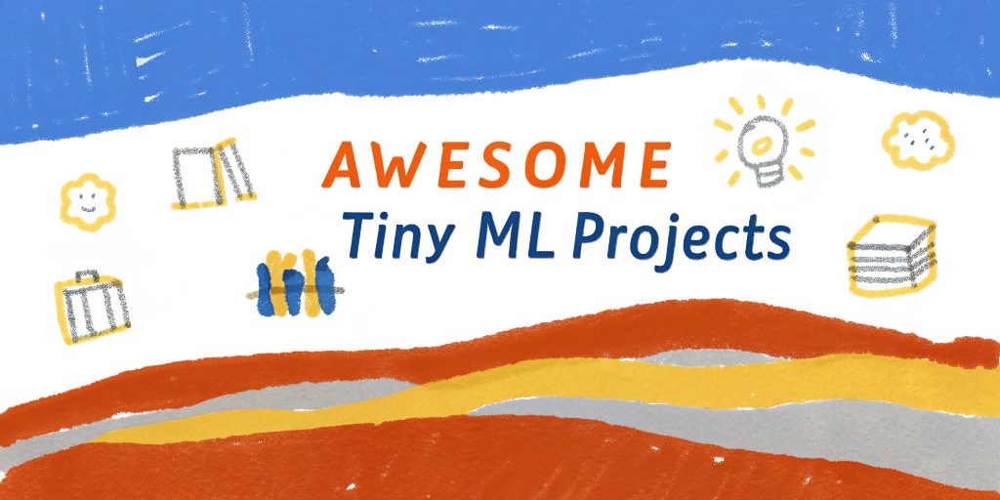

# Awesome tiny machine learning projects

A curated collection of github projects with tiny code base. Most of them are primarily interesting for educational purposes, but some of them (e.g. **[tinygrad](https://github.com/tinygrad/tinygrad)**) compete with large and complex projects.

  

<!-- omit from toc -->
## Contents

- [Andrej Karpathy](#andrej-karpathy)
- [🤗 Huggingface](#huggingface-)
- [ML](#ml)
- [C](#c)
- [Go](#go)
- [Rust](#rust)
- [Python](#python)
- [Low-level](#low-level)

### Andrej Karpathy
- **[cryptos](https://github.com/karpathy/cryptos)** - Pure Python from-scratch zero-dependency implementation of Bitcoin for educational purposes.
- **[llama2.c](https://github.com/karpathy/llama2.c)** - Inference Llama 2 in one file of pure C.
- **[llm.c](https://github.com/karpathy/llm.c)** - LLM training in simple, raw C/CUDA.
- **[micrograd](https://github.com/karpathy/micrograd)** - A tiny scalar-valued autograd engine and a neural net library on top of it with PyTorch-like API.
- **[minbpe](https://github.com/karpathy/minbpe)** - Minimal, clean code for the Byte Pair Encoding (BPE) algorithm commonly used in LLM tokenization.
- **[minGPT](https://github.com/karpathy/minGPT)** - A minimal PyTorch re-implementation of the OpenAI GPT (Generative Pretrained Transformer) training.
- **[nanoGPT](https://github.com/karpathy/nanoGPT)** - The simplest, fastest repository for training/finetuning medium-sized GPT.
- **[nano-llama31](https://github.com/karpathy/nano-llama31)** - nanoGPT style version of Llama 3.1.

## 🤗 Huggingface
- **[nanotron](https://github.com/huggingface/nanotron)** - Minimalistic large language model 3D-parallelism training.
- **[nanoVLM](https://github.com/huggingface/nanoVLM)** - The simplest, fastest repository for training/finetuning small-sized VLMs.
- **[smolagents](https://github.com/huggingface/smolagents)** - A barebones library for agents that think in code.
- **[smol-course](https://github.com/huggingface/smol-course)** - A course on aligning smol models.
- **[smollm](https://github.com/huggingface/smollm)** - Everything about the SmolLM and SmolVLM family of models.

## ML
- **[micro_diffusion](https://github.com/SonyResearch/micro_diffusion)** - Micro-budget training of large-scale diffusion models.
- **[mini-swe-agent](https://github.com/SWE-agent/mini-swe-agent)** - The 100 line AI agent that solves GitHub issues or helps you in your command line.
- **[modded-nanogpt](https://github.com/KellerJordan/modded-nanogpt)** - NanoGPT (124M) in 3 minutes on 8xH100.
- **[modded-nanogpt-rwkv](https://github.com/BlinkDL/modded-nanogpt-rwkv)** - Modified variant of nanoGPT for RWKV.
- **[nano-graphrag](https://github.com/gusye1234/nano-graphrag?tab=readme-ov-file)** - A simple, easy-to-hack GraphRAG implementation.
- **[nanoT5](https://github.com/PiotrNawrot/nanoT5)** - Fast & Simple repository for pre-training and fine-tuning T5-style models.
- **[nano-vllm](https://github.com/GeeeekExplorer/nano-vllm)** - Nano vLLM.
- **[tinygrad](https://github.com/tinygrad/tinygrad)** - You like pytorch? You like micrograd? You love tinygrad! ❤️
- **[tinyvector](https://github.com/0hq/tinyvector)** - A tiny nearest-neighbor embedding database built with SQLite and Pytorch.
- **[TinyZero](https://github.com/Jiayi-Pan/TinyZero)** - Minimal reproduction of DeepSeek R1-Zero.

## C
- **[miniaudio](https://github.com/mackron/miniaudio)** - Audio playback and capture library written in C, in a single source file.
- **[printf](https://github.com/mpaland/printf)** - Tiny, fast, non-dependent and fully loaded printf implementation for embedded systems.
- **[tiny-AES-c](https://github.com/kokke/tiny-AES-c)** - Small portable AES128/192/256 in C.

## Go
- **[minikeyvalue](https://github.com/geohot/minikeyvalue)** - A distributed key value store in under 1000 lines.
- **[tinykv](https://github.com/talent-plan/tinykv)** - A course to build distributed key-value service based on TiKV model.

## Rust
- **[microsandbox](https://github.com/microsandbox/microsandbox)** - Self-Hosted Platform for Secure Execution of Untrusted User/AI Code.
- **[mini-redis](https://github.com/tokio-rs/mini-redis)** - Incomplete Redis client and server implementation using Tokio - for learning purposes only.
- **[mini-lsm](https://github.com/skyzh/mini-lsm)** - A course of building an LSM-Tree storage engine (database) in a week.

## Python
- **[tinychain](https://github.com/jamesob/tinychain)** - A pocket-sized implementation of Bitcoin.

## Low-level
- **[tiny-gpu](https://github.com/adam-maj/tiny-gpu)** - A minimal GPU design in Verilog to learn how GPUs work from the ground up.
- **[tiny-tpu](https://github.com/tiny-tpu-v2/tiny-tpu)** - A minimal tensor processing unit (TPU), inspired by Google's TPU V2 and V1.
